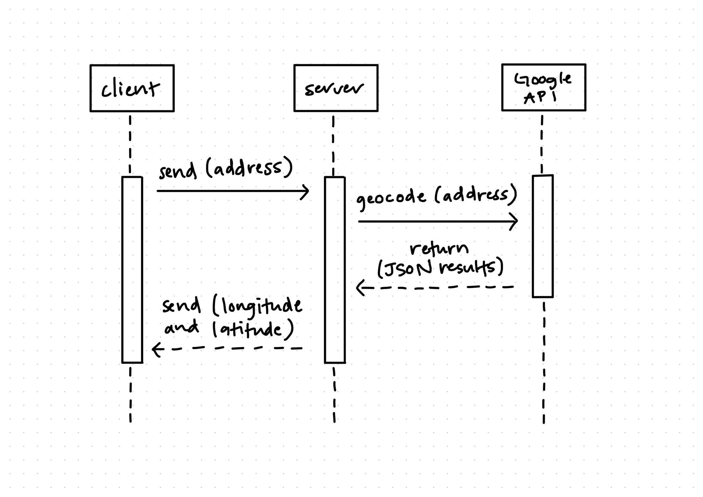

# Geocoding-Microservice
A microservice for using Google's Geocoding API. Created for CS 361. 

This microservice accepts an address in the form of a string and returns the longitude and latitude corresponding to that address. The geocoding is done by using Google Maps's Geocoding API. For documentation on the API's request and response parameters, please see [here](https://developers.google.com/maps/documentation/geocoding/requests-geocoding). A Google Maps API key will be needed to use this microservice, one can be obtained for free from [here](https://developers.google.com/maps/documentation/javascript/get-api-key). The API key can be manually entered into the server.js file or included in a .env file to maintain security. 

This microservice uses ZeroMQ to recieve requests and send data. ZeroMQ is an asynchronous messaging library that facilitates communication between different applications. For more information on ZeroMQ and documentation please see [here](https://zguide.zeromq.org/docs/chapter1/).

**How to request data:**

As mentioned above, this microservice communicates with ZeroMQ. This means you'll need to have the ZeroMQ module loaded.

`const zmq = require('zeromq');`

To request data, you need to be connected to the same port as the microservice's server. By default, the port is set to 5555 but this can be changed in the code for the server and client. The code for connecting to the port is:

`requester.connect("tcp://localhost:5555");`

After connecting to the correct port you will need to set up the socket for sending requests.

`const requester = zmq.socket('req');`

Finally you can send a request containing the address you want the longitude and latitude for.

`requester.send("ADDRESS");`

Example call: `requester.send("97331");`

**How to receive data:**

After being sent an address, the geocoding microservice will use the Google Maps API to convert the address into a longitude and latitude. This data is then sent to the client via a string in the format of "Longitude, Latitude". To recieve this response the socket must be set up on the client's end.

`let result;`

`requester.on("message", function (reply) {`

  `console.log("Received reply", ": [", reply.toString(), ']');`

  `result = reply.toString();`

`});`

This is an example of one way you can receive the data. In this example the response is displayed in the client's console and also saved to the result variable for future use. The microservice can be modified to return other geocoding information if needed. Please see the documentation link above for this.

**UML Sequence Diagram:**

